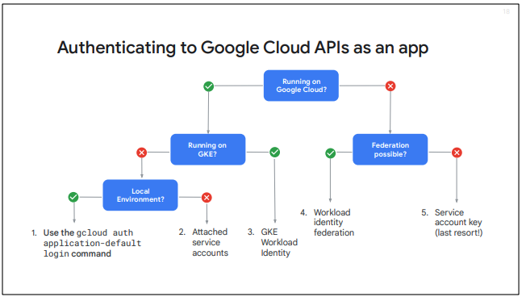

## Diferença entre IaaS e PaaS na GCP
### IaaS (Infrastructure as a Service) 
Fornece infraestrutura de TI virtualizada, como servidores, 
redes, armazenamento e sistemas operacionais. O usuário tem controle total sobre a configuração, mas 
precisa gerenciar o sistema operacional, atualizações e segurança.
 - Compute Engine
 - Cloud Storage
 - VPC
 - Cloud Load Balacing

### PaaS (Platform as a Service) 
Fornece uma plataforma gerenciada, onde o usuário se preocupa apenas com o
 desenvolvimento e implantação de aplicativos, sem precisar gerenciar servidores, SOs ou
  infraestrutura subjacente.
 - App Engine
 - Cloud Functions
 - Cloud Run
 - Firebase

## Resumo das Diferenças

| Característica        | IaaS (Infrastructure as a Service)       | PaaS (Platform as a Service)         |
|----------------------|------------------------------------|--------------------------------|
| **Nível de controle** | Alto (gerencia SO, rede, segurança) | Médio/Baixo (foca apenas na aplicação) |
| **Gerenciamento**     | Hardware virtual, SO, configurações | Apenas código e lógica da aplicação |
| **Escalabilidade**    | Manual ou semi-automatizado         | Totalmente automatizado |
| **Tempo de configuração** | Demorado (instalação e manutenção necessárias) | Rápido (deploy simplificado) |
| **Exemplo na GCP**   | Compute Engine, Cloud Storage, VPC  | App Engine, Cloud Run, BigQuery |

## SaaS (Software as a Service) 
É um modelo de computação em nuvem onde os usuários acessam aplicativos através da internet, sem necessidade de instalação ou gerenciamento de infraestrutura. O provedor do serviço cuida de atualizações, manutenção, segurança e escalabilidade, permitindo que os usuários simplesmente utilizem o software.
 - Google Worspace
 - Google Cloud Identity
 - BigQuery
 - Google Analytics
 - Google Meets

 ## Zona e Região
 Região é uma área geográfica específica que contém várias Zonas.
 ✔ Localização geográfica única → Cada região representa um país ou cidade específica.
✔ Composta por múltiplas Zonas → Normalmente, tem três ou mais zonas dentro dela.
✔ Baixa latência → Todos os recursos dentro de uma mesma região têm comunicação rápida.
Exemplo de Regiões na GCP:

us-central1 → Iowa (EUA)
europe-west1 → Bélgica
asia-east1 → Taiwan

Zona é um data center físico dentro de uma Região.
✔ Cada Zona pertence a uma Região → Identificada como região-letra (ex: us-central1-a).
✔ Recursos dentro da mesma Zona têm menor latência entre si.
✔ Se uma Zona falhar, outras Zonas da mesma Região podem assumir a carga.
✔ Cada Zona tem recursos independentes (máquinas virtuais, discos, redes, etc.).

Exemplo de Zonas na GCP:
Na região us-central1 (Iowa, EUA), existem múltiplas zonas:
us-central1-a
us-central1-b
us-central1-c

## Hierarquia de recursos
📌 Organização (Organization)
 ├── 📂 Pasta (Folder) [Opcional]
 │    ├── 📂 Subpastas (Subfolders) [Opcional]
 │    │    ├── 📦 Projetos (Projects)
 │    │    │    ├── 🖥️ Recursos (Compute Engine, Cloud Storage, Cloud SQL, etc.)
 │    │    │
 │    │    ├── 📦 Projetos (Projects)
 │    │
 │    ├── 📦 Projetos (Projects)
 │
 ├── 📦 Projetos (Projects)
      ├── 🖥️ Recursos (VMs, Storage, BigQuery, etc.)

### Organização
Nível mais alto na hierarquia, representando a empresa ou domínio.

✔ Associado a um domínio do Google Workspace ou Cloud Identity.
✔ Controla políticas e permissões herdadas para todos os recursos abaixo.
✔ É obrigatório para contas corporativas, mas opcional para contas individuais.

Exemplo:

mycompany.com (Organização para todos os projetos da empresa)      

### Pastas
Agrupam projetos e subpastas dentro da Organização.

✔ Permitem segregar departamentos, equipes ou ambientes (Dev, Staging, Prod).
✔ As permissões e políticas podem ser aplicadas a um grupo de projetos.

Exemplo:

Departamento de TI
📂 Desenvolvimento
📂 Produção
📂 Equipe de Dados

### Projetos
Unidade fundamental na GCP para organizar recursos.

✔ Todos os recursos (VMs, Storage, APIs, etc.) devem estar dentro de um projeto.
✔ Cada projeto tem um ID único globalmente e um número de projeto.
✔ Projetos podem ser excluídos ou migrados para outras pastas.

Exemplo:

mycompany-prod
data-analytics-project
website-hosting

### Recursos
Serviços individuais criados dentro dos projetos.

✔ Representam máquinas virtuais, bancos de dados, armazenamento, etc.
✔ Herda permissões e políticas do projeto onde está localizado.

Exemplo:

Compute Engine → Instâncias de máquinas virtuais.
Cloud Storage → Buckets de armazenamento.
Cloud SQL → Banco de dados gerenciado.
BigQuery → Plataforma de análise de dados.

## Atributos de Projeto
Cada projeto na Google Cloud possui três identificadores principais:

| Campo            | Descrição                                                                                   | Exemplo             |
|-----------------|--------------------------------------------------------------------------------------------|---------------------|
| **Project ID**   | 🔹 **Único globalmente**   🔹 **Definido pelo usuário ou gerado automaticamente**   🔹 **Imutável após a criação** | `my-first-project` |
| **Project Name** | 🔹 **Nome amigável para identificação**   🔹 **Pode ser alterado a qualquer momento**   🔹 **Não precisa ser único** | `My First GCP Project` |
| **Project Number** | 🔹 **Número único gerado pelo Google Cloud**   🔹 **Imutável**   🔹 **Usado para APIs e billing** | `123456789012` |

---

### Exemplo de Projetos Criados na GCP

| Project ID         | Project Name            | Project Number |
|--------------------|------------------------|---------------|
| `my-first-project`  | My First GCP Project    | `123456789012`  |
| `data-analytics`    | Data Analytics Project  | `987654321098`  |
| `web-hosting-prod`  | Web Hosting - Production | `112233445566`  |
| `cloud-storage-app` | Cloud Storage Application | `334455667788`  |
| `bigquery-reports`  | BigQuery Reporting      | `556677889900`  |

---

### Explicação dos Campos
✔ **Project ID** → Um identificador **único e global**, gerado automaticamente ou definido pelo usuário. **Não pode ser alterado após a criação**.  
✔ **Project Name** → Nome amigável definido pelo usuário, **pode ser alterado a qualquer momento**.  
✔ **Project Number** → Um **identificador numérico único**, atribuído automaticamente pelo Google Cloud e **imutável**.

---

**Notas:**
- **Project ID** deve ser único em toda a Google Cloud e não pode ser reutilizado.  
- **Project Name** pode ser atualizado sem afetar configurações.  
- **Project Number** é útil para operações internas e APIs.  

## Roles e Policies
O IAM (Identity and Access Management) do Google Cloud é o sistema que controla quem pode acessar quais recursos dentro da plataforma. Ele funciona através de políticas (Policies) e papéis (Roles), garantindo segurança e um gerenciamento eficaz de permissões.

### O IAM tem três componentes principais:

- Identidade (Member): Representa quem recebe as permissões (usuários, grupos, contas de serviço ou domínios).
- Papel (Role): Conjunto de permissões atribuídas a uma identidade.
- Política IAM (Policy): Define quem pode fazer o quê em um recurso.

### Tipos de Roles
 - Papéis Predefinidos (Predefined Roles) – Recomendados
 
 Exemplos:
   - roles/storage.admin → Permite gerenciar buckets e objetos no Cloud Storage.
   - roles/bigquery.dataViewer → Concede permissão apenas para visualizar dados no BigQuery.
   - roles/compute.instanceAdmin → Permite gerenciar instâncias no Compute Engine.

 - Papéis Personalizados (Custom Roles) – Para maior controle
 - Papéis Básicos (Primitive Roles) – NÃO Recomendados

 ### Boas Práticas para Gerenciar IAM 
* Aplique o Princípio do Menor Privilégio → Conceda apenas as permissões necessárias.
* Prefira Roles Predefinidos ao invés de Primitive Roles → Para garantir mais segurança.
* Revise os acessos regularmente → Revogue permissões de usuários que não precisam mais delas.
* Utilize Grupos e Contas de Serviço → Em vez de atribuir permissões diretamente a usuários individuais.

## Cloud Identity
É a solução do Google Cloud Platform (GCP) para gerenciamento de identidades e acessos. Ele permite controlar usuários, grupos, dispositivos e permissões dentro de uma organização, garantindo segurança, conformidade e eficiência na administração de acessos.

### Usuários
São as identidades de pessoas dentro da organização, geralmente associadas a um e-mail corporativo (ex: maria@empresa.com).

✔ Permite autenticação centralizada com login único (SSO – Single Sign-On).
✔ Garante segurança com autenticação multifator (MFA).
✔ Controla permissões dentro da organização via IAM (Identity and Access Management).

### Grupos
Um grupo é um conjunto de usuários que compartilham as mesmas permissões e acessos a recursos.

✔ Facilita a administração de permissões → Em vez de atribuir acessos a cada usuário individualmente, o administrador pode conceder permissões a um grupo.
✔ Melhor controle de acessos → Exemplo: Grupo "Financeiro" pode acessar o BigQuery, enquanto "Desenvolvedores" têm permissões no Compute Engine.
✔ Integração com IAM → Grupos podem ser usados diretamente dentro de políticas IAM.

🔹 Exemplo de Grupo:

Grupo: dev-team@empresa.com
Membros: João, Maria, Pedro
Permissão: roles/compute.admin → O grupo tem acesso para administrar instâncias do Compute Engine.

### Dispositivos
O Cloud Identity gerencia dispositivos corporativos, garantindo que apenas dispositivos autorizados possam acessar os serviços da organização.

✔ Gerenciamento de dispositivos móveis (MDM - Mobile Device Management) → Controla acesso a partir de celulares e tablets.
✔ Aplicação de políticas de segurança → Exige criptografia de disco, senhas seguras, bloqueio remoto.
✔ Monitoramento e auditoria → Permite rastrear e bloquear dispositivos suspeitos.

🔹 Exemplo:
Se um funcionário perder o celular corporativo, o administrador pode bloquear o dispositivo remotamente para evitar acessos não autorizados.

### Aplicativos (Apps)
Gerencia quais aplicativos os usuários podem acessar dentro da organização.

✔ Integração com Google Workspace → Gmail, Drive, Docs, Sheets, Meet.
✔ Controle de acesso a aplicativos externos → Exemplo: Bloquear acesso a serviços não autorizados.
✔ SSO (Single Sign-On) → Usuários podem fazer login uma única vez e acessar vários sistemas corporativos sem precisar de várias senhas.

🔹 Exemplo:

A empresa define que apenas usuários autenticados via Cloud Identity podem acessar Slack, Trello e GitHub.
Qualquer tentativa de login externo será bloqueada.

## Maneiras de iteragir com o GCP
### Google Cloud CLI
A CLI oficial do GCP (gcloud) permite executar comandos para gerenciar recursos sem precisar acessar a interface gráfica.

✔ Útil para automação e scripts.
✔ Mais rápido que o console web para algumas tarefas repetitivas.
✔ Permite interagir com Compute Engine, Cloud Storage, IAM, Kubernetes, BigQuery e outros serviços.

### Cloud Shell 
O Cloud Shell é um terminal baseado na nuvem integrado ao Google Cloud Console. Ele permite executar comandos gcloud, kubectl, terraform, e outros sem precisar instalar nada localmente.

✔ Acesso imediato ao terminal sem configuração local.
✔ Inclui ferramentas pré-instaladas, como Python, Git, Terraform e kubectl.
✔ Ambiente persistente com armazenamento de 5GB gratuito.

### Google Cloud REST APIs
As APIs REST do Google Cloud permitem acessar e gerenciar recursos programaticamente, sem precisar usar a interface web ou CLI.

✔ Ideal para integração com sistemas externos e automação.
✔ Pode ser usada em Python, Java, Node.js, Go, C#, Ruby, etc.
✔ Utiliza chaves de API ou OAuth 2.0 para autenticação.

### Google Cloud Client Libraries (SDKs para Linguagens de Programação)
O GCP disponibiliza SDKs para diversas linguagens, facilitando o desenvolvimento de aplicações que interagem com seus serviços.

✔ Permite criar, gerenciar e monitorar serviços GCP diretamente no código.
✔ Reduz a complexidade do uso da API REST.
✔ Disponível para Python, Java, Go, Node.js, C#, Ruby e PHP.

### Terraform (Infraestrutura como Código - IaC)
O Terraform permite definir e provisionar infraestrutura na GCP usando arquivos de configuração.

✔ Automação e controle de infraestrutura em código.
✔ Ideal para DevOps e ambientes de produção escaláveis.
✔ Evita erros manuais e facilita replicação de ambientes.

## Deploying Applications
### Code
Nesta fase, os desenvolvedores escrevem e versionam o código-fonte da aplicação.

✔ Utilização de repositórios Git para versionamento e colaboração.
✔ Integração com ferramentas como Cloud Source Repositories, GitHub ou GitLab.
✔ Pode incluir revisões de código (code review) e scans de segurança antes do build.

🔹 Ferramentas no GCP:

Cloud Source Repositories → Repositório privado para armazenar código.
Artifact Registry → Armazena pacotes, imagens de contêiner e artefatos de build.

### Build
Aqui, o código-fonte é transformado em um artefato pronto para ser implantado.

✔ O código é compilado, empacotado e verificado.
✔ Pode incluir análise estática de código e testes unitários.
✔ Criação de imagens de contêiner para implantação em ambientes Kubernetes.

🔹 Ferramentas no GCP:

Cloud Build → Serviço de CI/CD que compila e gera artefatos automaticamente.
Container Registry / Artifact Registry → Armazena imagens de contêiner para Kubernetes.
Cloud Functions Build → Para aplicações serverless baseadas em funções

### Deploy
O software é implantado automaticamente ou sob demanda em um ambiente específico.

✔ Estratégias de deploy como blue-green, canary, rolling updates.
✔ Pode ser feito em máquinas virtuais, Kubernetes ou ambientes serverless.
✔ Controle de versões e rollback em caso de falha.

🔹 Ferramentas no GCP:

Cloud Run → Para rodar contêineres sem gerenciar servidores.
Google Kubernetes Engine (GKE) → Implantação escalável em Kubernetes.
App Engine → Plataforma serverless gerenciada para aplicações web.
Compute Engine → Para deploy em VMs personalizadas.

### Test
Última fase antes de liberar para produção, garantindo a confiabilidade da aplicação.

✔ Testes automatizados: unitários, integração, carga, segurança e regressão.
✔ Monitoramento e logging em produção para detectar problemas rapidamente.
✔ Automação de rollback caso falhas sejam detectadas.

🔹 Ferramentas no GCP:

Cloud Monitoring → Coleta métricas de desempenho.
Cloud Logging → Armazena e analisa logs da aplicação.
Cloud Trace → Identifica gargalos de performance.
Cloud Testing (Firebase Test Lab) → Teste automatizado para apps mobile.

### Release
Nesta fase, a aplicação já foi testada e está pronta para ser disponibilizada aos usuários.

✔ Automação do Deploy → A entrega pode ser totalmente automatizada ou sob aprovação manual.
✔ Gerenciamento de Versões → Mantém controle de versões e possibilita rollback em caso de falha.
✔ Estratégias de Deploy → Blue-Green, Canary Release, Rolling Update, entre outras.

🔹 Ferramentas no GCP para Release:

Cloud Deploy → Serviço gerenciado para pipelines de entrega contínua.
Google Kubernetes Engine (GKE) → Atualizações contínuas para contêineres Kubernetes.
Cloud Run → Atualizações automáticas para aplicações serverless baseadas em contêineres.
App Engine → Deploy e rollback automatizados para aplicativos web.
Compute Engine → Scripts automatizados para VMs.

### Monitor
Depois do release, é fundamental monitorar a aplicação para identificar falhas e otimizar o desempenho.

✔ Métricas de desempenho e uso → Tempo de resposta, taxa de erro, latência, etc.
✔ Monitoramento de logs e alertas → Identificação de erros e falhas em tempo real.
✔ Automação de rollback → Caso falhas sejam detectadas, a versão anterior pode ser restaurada automaticamente.

🔹 Ferramentas no GCP para Monitoramento:

Cloud Monitoring → Coleta métricas de VMs, Kubernetes, Cloud Run, App Engine e mais.
Cloud Logging → Centraliza logs de aplicação, banco de dados e infraestrutura.
Cloud Trace → Identifica gargalos de performance e tempo de resposta de APIs.
Cloud Error Reporting → Detecta e agrupa erros automaticamente.
Cloud Profiler → Análise de performance do código em produção.

## Porque usar Containers e Kubernetes?
Os containers e o Kubernetes são amplamente utilizados para modernizar a implantação e a escalabilidade de aplicações. Eles oferecem maior portabilidade, eficiência e automação, tornando a infraestrutura de TI mais resiliente e escalável.

### Containers
Containers são unidades leves e portáteis que empacotam uma aplicação junto com todas as suas dependências (bibliotecas, runtime, configurações) para rodar de maneira consistente em qualquer ambiente.

✔ Portabilidade → Um container pode rodar em qualquer ambiente, desde o laptop de um desenvolvedor até servidores na nuvem.
✔ Consistência → "Funciona na minha máquina" não é mais um problema; o container garante o mesmo comportamento em qualquer lugar.
✔ Eficiência → Containers compartilham o mesmo kernel do sistema operacional, consumindo menos recursos do que máquinas virtuais.
✔ Isolamento → Cada container executa sua própria aplicação separadamente, evitando conflitos entre dependências.
✔ Escalabilidade → Facilita a criação de múltiplas instâncias da aplicação conforme a demanda.

### Kubernetes
O Kubernetes é uma plataforma de orquestração de containers que gerencia a implantação, escalabilidade e operação de aplicações baseadas em containers.

✔ Automação de Deploys e Rollbacks → Permite lançar novas versões automaticamente e reverter em caso de falha.
✔ Balanceamento de Carga → Distribui o tráfego entre várias instâncias da aplicação.
✔ Escalabilidade Automática → Aumenta ou reduz o número de containers com base no uso de CPU e memória.
✔ Gerenciamento de Recursos → Garante o uso eficiente de CPU e memória, alocando recursos conforme necessário.
✔ Alta Disponibilidade → Se um nó do cluster falhar, o Kubernetes redistribui os containers automaticamente.

## Compute Engine, Kubernetes Engine, Cloud Run e Cloud Functions
# Comparação entre Compute Engine, Kubernetes Engine, Cloud Run e Cloud Functions

| Característica         | Compute Engine (VMs)        | Kubernetes Engine (GKE)  | Cloud Run (Serverless Containers) | Cloud Functions (FaaS) |
|------------------------|---------------------------|-------------------------|----------------------------------|------------------------|
| **Modelo de Execução**  | Máquinas Virtuais (VMs)    | Orquestração de Containers | Containers Serverless            | Funções Serverless     |
| **Gerenciamento**       | Totalmente gerenciado pelo usuário | Kubernetes gerenciado pelo usuário | Totalmente gerenciado pelo Google | Totalmente gerenciado pelo Google |
| **Escalabilidade**      | Manual ou Autoscaler       | Automático via Kubernetes | Automático (scale to zero)      | Automático (scale to zero) |
| **Tempo de Inicialização** | Minutos                  | Segundos a minutos       | Milissegundos a segundos        | Milissegundos          |
| **Casos de Uso**        | Aplicações legadas, bancos de dados, workloads personalizados | Aplicações escaláveis baseadas em containers | APIs, microsserviços, aplicações event-driven | Tarefas curtas, event-driven (triggers como Pub/Sub, Cloud Storage) |
| **Custo**              | Paga pelo tempo da VM ativa | Paga pelos nós e recursos alocados | Paga somente pelo uso (segundos de execução) | Paga apenas pelo tempo de execução da função |
| **Flexibilidade**      | Total controle do SO e configuração | Controle dos containers e rede | Menos controle, mas simplificado | Sem controle sobre infraestrutura |
| **Rede**              | Configuração manual | Integração com redes e balanceamento de carga | HTTP/HTTPS, suporte a VPC | HTTP/HTTPS, Pub/Sub, Cloud Storage triggers |
| **Atualizações e Deploys** | Manuais ou via scripts | Gerenciados via Kubernetes | Automatizados e rápidos | Automatizados |
| **Persistência de Estado** | Sim (Discos Persistentes) | Sim (Discos em nós Kubernetes) | Não (stateless) | Não (stateless) |

## App Engine
É uma plataforma serverless gerenciada no Google Cloud que permite desenvolver, implantar e escalar aplicações web sem precisar gerenciar infraestrutura. Ele suporta diversas linguagens e frameworks populares, automatizando escalabilidade, segurança e balanceamento de carga.

Infraestrutura Gerenciada → O Google cuida dos servidores, rede, segurança e escalabilidade.
✔ Escalabilidade Automática → Aumenta ou reduz recursos de acordo com a demanda (escala até zero).
✔ Suporte a Várias Linguagens → Nativamente suporta Python, Java, Node.js, Go, PHP, Ruby e .NET.
✔ Fácil Deploy → Apenas um comando para implantar aplicações.
✔ Banco de Dados Integrado → Suporte ao Cloud Datastore, Firestore e Cloud SQL.
✔ Segurança → Atualizações automáticas de patches e integração com IAM e Identity-Aware Proxy (IAP).
✔ Dois Ambientes Disponíveis → Standard Environment (serverless total) e Flexible Environment (maior controle).

### Modelos de Execução do App Engine
#### Standard Environment (Ambiente Padrão)
Ideal para aplicações leves e altamente escaláveis.

✔ Tempo de inicialização rápido (milissegundos a segundos).
✔ Suporte a linguagens com runtime gerenciado.
✔ Escala automaticamente até zero (sem cobrança se não estiver em uso).
✔ Restrições de runtime e configurações fixas.

🔹 Casos de Uso:

Aplicações web de alta demanda.
APIs de backend que precisam de resposta rápida.
Microsserviços sem necessidade de persistência no sistema de arquivos.

#### Flexible Environment (Ambiente Flexível)
Para aplicações mais robustas que precisam de mais controle.

✔ Suporte a qualquer linguagem usando containers Docker.
✔ Execução em máquinas virtuais gerenciadas.
✔ Acesso a rede e configurações personalizadas.
✔ Tempo de inicialização mais alto (segundos a minutos).

🔹 Casos de Uso:

Aplicações que exigem bibliotecas personalizadas ou runtime próprio.
Processamento de dados contínuo.
Aplicações que precisam de acesso a recursos do sistema operacional.

## Monitoramento
| Serviço              | O que faz?                                      | Melhor para...                                  | Tipo de Dados Coletados       | Integração com Alertas |
|----------------------|--------------------------------|--------------------------------|-----------------------------|----------------------|
| **Cloud Logging**   | Armazena e analisa logs de aplicações, sistemas e infraestrutura. | Monitoramento de logs e auditoria. | Logs de eventos, erros e auditoria. | Sim (com Cloud Monitoring) |
| **Cloud Trace**     | Analisa latência e desempenho de aplicações distribuídas. | Identificar gargalos de performance. | Tempo de execução de requisições e dependências. | Sim |
| **Cloud Monitoring** | Coleta e exibe métricas de desempenho de serviços e infraestrutura. | Monitoramento em tempo real e geração de alertas. | Uso de CPU, memória, latência, uptime. | Sim |
| **Error Reporting** | Detecta, agrupa e alerta sobre erros de aplicações automaticamente. | Diagnóstico de falhas e estabilidade do sistema. | Stack traces de exceções e falhas. | Sim |
| **Cloud Profiler**  | Analisa o consumo de CPU e memória de aplicações em produção. | Otimização de código e redução de custos computacionais. | Dados de CPU, memória e tempo de execução. | Não |

- **Cloud Logging** → Melhor para **registro e auditoria de eventos e logs** de sistemas e aplicações.  
- **Cloud Trace** → Ideal para **identificar gargalos de latência** em aplicações distribuídas.  
- **Cloud Monitoring** → Essencial para **acompanhar métricas de performance** e ativar **alertas automáticos**.  
- **Error Reporting** → Ajuda na **identificação e rastreamento de erros** de aplicações.  
- **Cloud Profiler** → Ferramenta avançada para **analisar e otimizar desempenho** da aplicação.  

## SLI e SLO
O **Service Level Indicator (SLI)** é uma **métrica quantitativa** que mede a **qualidade e desempenho de um serviço**. Ele representa o nível real de um serviço com base em parâmetros como:

✔ **Disponibilidade** → Percentual de tempo que um serviço está funcionando corretamente.  
✔ **Latência** → Tempo de resposta médio ou percentual de requisições abaixo de um limite.  
✔ **Taxa de erro** → Percentual de requisições bem-sucedidas versus falhas.  
✔ **Vazão (Throughput)** → Número de requisições processadas por segundo.  

🔹 **Exemplo de SLI:**  
- "O serviço respondeu com sucesso em **99,95% das requisições nos últimos 30 dias**."
- "A latência média das requisições foi inferior a **200ms** em 95% dos casos."

## O que é SLO (Service Level Objective)?
O **Service Level Objective (SLO)** é o **objetivo que a equipe define** para um SLI, servindo como **meta de desempenho** do serviço. Ele ajuda a garantir que um serviço **atenda às expectativas** de qualidade e confiabilidade.

✔ **SLOs são usados para definir SLAs (Service Level Agreements)**.  
✔ **Define um alvo que deve ser monitorado continuamente**.  
✔ **Ajuda a tomar decisões sobre escalabilidade e otimização de recursos**.  

**Exemplo de SLO:**  
- "Nosso objetivo é garantir que **99,9% das requisições sejam processadas com sucesso**."
- "A latência média deve ser **inferior a 150ms em 99% das requisições**."

---

#### Como Usar SLI e SLO no GCP?
No Google Cloud, podemos definir e monitorar **SLIs e SLOs** usando o **Cloud Monitoring**.  

### **Passos para Configuração no GCP:**
1 - **Definir um SLI** → Escolher a métrica que representa a qualidade do serviço.  
2 - **Estabelecer um SLO** → Definir a meta de desempenho esperada.  
3 - **Monitorar no Cloud Monitoring** → Criar dashboards e alertas.  
4 - **Gerar relatórios e tomar ações** → Identificar falhas e ajustar a infraestrutura.  

## Apigee API Managemen
Plataforma completa de gerenciamento de APIs, oferecida pela Google Cloud Platform (GCP). Ele permite que empresas projetem, protejam, analisem e escalem APIs de forma eficiente, garantindo segurança, governança e monitoramento em tempo real. O Apigee é ideal para organizações que desejam expor serviços de forma segura, criar ecossistemas de APIs e monetizar dados.

- Gerenciamento Completo de APIs: Permite o controle total sobre ciclo de vida, versionamento e políticas de API.
- Segurança Avançada: Implementação de OAuth, JWT, autenticação via API Keys e proteção contra ataques.
- Monitoramento e Analytics: Insights em tempo real sobre uso da API, falhas e desempenho.
- Transformação e Orquestração de APIs: Converte formatos como REST para SOAP, manipula payloads e realiza roteamento inteligente.
- Monetização de APIs: Empresas podem cobrar pelo uso de APIs, oferecendo planos baseados em consumo.
- Desenvolvimento de API Proxies: Criação de proxies de API para garantir abstração e compatibilidade entre diferentes versões.
- Suporte Multi-Cloud e On-Premise: Pode ser implantado na GCP, outras nuvens ou localmente.
- Integração com DevOps: Suporte a CI/CD, automação e deploy contínuo.

## Cloud Storage Databases
 - Cloud Storage
 - Firestore
 - Bigtable
 - Cloud SQL
 - AlloyDB
 - Spanner
 - BigQuery
 - Memorystore

## Cloud Storage
- Armazenamento Escalável: Permite armazenar desde pequenos arquivos até petabytes de dados.
- Acesso Global: Os dados podem ser acessados de qualquer lugar com baixa latência.
- Alta Disponibilidade: O serviço oferece redundância automática para evitar perda de dados.
- Segurança e Controle de Acesso: Permite criptografia integrada e gerenciamento de permissões via IAM (Identity and Access Management).
- Classes de Armazenamento Otimizadas: Escolha entre diferentes classes para otimizar custo e desempenho (Standard, Nearline, Coldline e Archive).
- Integração com Outros Serviços da GCP: Pode ser usado com BigQuery, Dataflow, AI/ML e Compute Engine.
- Suporte a Versionamento e Recuperação: Possibilita o versionamento de arquivos e recuperação de dados excluídos.

### Firestore
- Banco de Dados NoSQL Document-based: Os dados são armazenados em documentos JSON dentro de coleções, permitindo estruturas flexíveis e consultas eficientes.
- Sincronização em Tempo Real: Ideal para aplicações que precisam refletir mudanças instantaneamente (exemplo: chats, dashboards, notificações).
- Consultas Rápidas e Escaláveis: Suporta filtros avançados, ordenação e índices automáticos para consultas eficientes.
- Modo Online e Offline: Os dados podem ser armazenados em cache no dispositivo para funcionamento offline, sincronizando automaticamente quando reconectado.
- Segurança Baseada em Regras: Controle de acesso granular via Firestore Security Rules e IAM (Identity and Access Management).
- Integração com Firebase e GCP: Conecte-se facilmente com Firebase Authentication, Cloud Functions, BigQuery e Google Cloud Storage.
- Alta Disponibilidade e Escalabilidade: Infraestrutura totalmente gerenciada e distribuída globalmente.

### Bigtable
- Banco de Dados NoSQL Colunar: Armazena dados em linhas e colunas, permitindo acesso rápido e eficiente a grandes volumes de dados.
- Altamente Escalável: Pode lidar com petabytes de dados e milhões de operações por segundo.
- Baixa Latência e Alto Throughput: Projetado para cargas de trabalho intensivas, como análises em tempo real e machine learning.
- Integração com Google Cloud Ecosystem: Suporte nativo para BigQuery, Dataflow, Dataproc, AI/ML e Kubernetes.
- Armazenamento Distribuído Globalmente: Replicação automática para garantir alta disponibilidade e tolerância a falhas.
- Gerenciado e Serverless: O Google gerencia a infraestrutura, permitindo foco no desenvolvimento e escalabilidade automática.
- Otimizado para Leituras e Gravações Rápidas: Perfeito para aplicações que exigem alta taxa de leitura/escrita.
- Modelo de Custo Baseado no Uso: Paga-se apenas pelos recursos utilizados, sem necessidade de provisionamento fixo.

### Cloud SQL
- Banco de Dados Relacional Gerenciado: Compatível com MySQL, PostgreSQL e SQL Server.
- Infraestrutura Escalável: Permite aumentar ou reduzir recursos conforme a necessidade.
- Backups Automáticos e Replicação: Oferece failover automático e backup diário para garantir disponibilidade.
- Segurança e Controle de Acesso: Suporte a IAM (Identity and Access Management), criptografia de dados e autenticação SSL.
- Alta Disponibilidade e Redundância: Suporte a replicação regional para minimizar falhas.
- Integração com Outros Serviços da GCP: Conecta-se facilmente com App Engine, Compute Engine, Kubernetes, BigQuery e Cloud Functions.
- Monitoramento e Logging: Suporte a Cloud Monitoring e Cloud Logging para acompanhamento do desempenho.
- Fácil Migração: Compatível com ferramentas como Database Migration Service (DMS) para mover bancos existentes para a nuvem.

### AlloyDB
- Compatibilidade Total com PostgreSQL: Suporte completo ao ecossistema PostgreSQL, facilitando a migração de bancos existentes.
- Desempenho Aprimorado: Até 4x mais rápido que o PostgreSQL padrão em cargas transacionais e 100x mais rápido em análises complexas.
- Armazenamento Colunar para Consultas Analíticas: Otimizado para análises de grande escala, sem necessidade de ETL.
- Alta Disponibilidade e Failover Rápido: Tempo de failover de menos de 60 segundos sem perda de dados.
- Escalabilidade Automática: Capacidade de escalar dinamicamente para lidar com picos de tráfego sem afetar a performance.
- Gerenciamento Totalmente Automatizado: Sem necessidade de administração manual de infraestrutura, backups e otimização de índices.
- Segurança Avançada: Criptografia de dados em repouso e em trânsito, controle de acesso granular via IAM (Identity and Access Management).
- Integração com a GCP: Conecte-se facilmente a serviços como BigQuery, AI/ML, Dataflow e Kubernetes.

### Spanner
- Banco de Dados Relacional e Distribuído: Suporte a SQL (ANSI 2011), índices secundários, joins e transações ACID.
- Escalabilidade Horizontal Automática: Projetado para crescer dinamicamente sem degradação de desempenho.
- Alta Disponibilidade e Tolerância a Falhas: Replicação síncrona com 99,999% de SLA (tempo de inatividade inferior a 5 minutos por ano).
- Consistência Forte Globalmente: Diferente de muitos bancos NoSQL, mantém consistência transacional mesmo em múltiplas regiões.
- Particionamento Automático (Sharding): Distribui dados automaticamente para otimizar desempenho e escalabilidade.
- Baixa Latência e Alto Throughput: Suporte a milhares de transações por segundo com resposta rápida.
- Suporte a APIs SQL e Google Standard SQL: Fácil adoção para desenvolvedores acostumados com bancos relacionais tradicionais.
- Segurança de Nível Empresarial: Controle de acesso com IAM (Identity and Access Management), criptografia integrada e auditoria detalhada.

### BigQuery
- Banco de Dados Analítico Serverless: Sem necessidade de gerenciar servidores ou provisionar recursos.
- Alta Escalabilidade e Performance: Projetado para consultas massivas, lidando com petabytes de dados em segundos.
- Consultas SQL Padrão (ANSI 2011): Fácil adoção para usuários que já conhecem bancos relacionais tradicionais.
- Modelo de Cobrança por Uso: Pague apenas pelo que processa (on-demand pricing) ou utilize capacidade reservada para otimizar custos.
- Suporte a Particionamento e Clustering: Melhor otimização de performance em consultas de grandes volumes de dados.
- Integração com Machine Learning (BigQuery ML): Treine e execute modelos de machine learning diretamente no banco de dados.
- Processamento de Dados em Tempo Real: Compatível com Cloud Pub/Sub e Dataflow para ingestão de dados em streaming.
- Segurança e Governança de Dados: Controle de acesso detalhado via IAM (Identity and Access Management) e suporte a criptografia avançada.
- Integração com o Ecossistema Google Cloud: Conecte-se facilmente a Looker, Data Studio, AI/ML, Cloud Storage e Bigtable.

### Memorystore
- Armazenamento In-Memory: Utiliza RAM para oferecer baixa latência (< 1ms) e alto throughput.
- Compatibilidade com Redis e Memcached: Suporte total aos comandos nativos, permitindo migração fácil de ambientes existentes.
- Alta Disponibilidade e Replicação: Suporte a failover automático, garantindo resiliência e continuidade dos dados.
- Escalabilidade Vertical e Horizontal: Aumente ou reduza os recursos sem precisar gerenciar infraestrutura.
- Segurança e Controle de Acesso: Gerenciado via IAM (Identity and Access Management), com criptografia e isolamento de rede via VPC.
- Gerenciamento Automático: Google cuida de atualizações, patches e monitoramento de desempenho.
- Integração com GCP: Fácil conexão com Cloud SQL, Spanner, Firestore, Bigtable, Compute Engine e Kubernetes Engine.

## Comparação de Casos de Uso - Soluções de Banco de Dados da GCP

| Solução      | Tipo | Melhor para | Casos de Uso |
|-------------|------|------------|--------------|
| **Cloud Storage** | Armazenamento de Objetos | Arquivamento e distribuição de arquivos | Backups, armazenamento de mídia (imagens, vídeos), logs, data lakes |
| **Cloud Firestore** | Banco de Dados NoSQL | Aplicações web e mobile em tempo real | Chats, notificações, sincronização offline, perfis de usuário |
| **Cloud Bigtable** | Banco de Dados NoSQL Colunar | Grandes volumes de dados e análise em tempo real | IoT, análise de séries temporais, machine learning, dados de telecom |
| **Cloud SQL** | Banco de Dados Relacional | Aplicações transacionais com estrutura SQL | Aplicações web tradicionais, ERPs, CRMs, bancos MySQL/PostgreSQL/SQL Server |
| **AlloyDB** | Banco de Dados Relacional (Otimizado para PostgreSQL) | Alto desempenho para cargas transacionais e analíticas | Aplicações empresariais escaláveis, análises rápidas sem ETL, migração de PostgreSQL |
| **Cloud Spanner** | Banco de Dados Relacional Distribuído | Aplicações globais e altamente escaláveis | Bancos digitais, marketplaces, jogos online, ERP e telecom |
| **BigQuery** | Data Warehouse Analítico | Processamento de grandes volumes de dados e BI | Business intelligence, análise de marketing, detecção de fraudes, machine learning |

---
## **Resumo das Diferenças**
## 🔍 **Resumo das Diferenças**
- **Cloud Storage** → Melhor para **armazenamento de arquivos e backups**, maior latência.
- **Firestore** → Excelente para **apps em tempo real**, com latência muito baixa.
- **Bigtable** → Melhor para **análises de grandes volumes de dados e IoT**.
- **Cloud SQL** → Para **aplicações relacionais tradicionais**, latência consistente.
- **AlloyDB** → Otimizado para **desempenho superior em PostgreSQL**.
- **Spanner** → Melhor para **sistemas distribuídos globalmente**.
- **BigQuery** → Focado em **grandes volumes de dados e processamento analítico**.
- **Memorystore** → **Latência ultrabaixa**, ideal para **cache, filas e processamento rápido**.

| Produto         | Read Latency | Write Latency | Tamanho Típico | Tipo de Armazenamento |
|---------------|-------------|--------------|---------------|------------------|
| **Cloud Storage** | Milissegundos a segundos | Milissegundos a segundos | De megabytes a petabytes | Objetos (arquivos, blobs) |
| **Cloud Firestore** | < 10 ms | < 10 ms | De MB a TB | NoSQL Document-based |
| **Cloud Bigtable** | < 10 ms | < 10 ms | De TB a PB | NoSQL Colunar |
| **Cloud SQL** | < 10 ms | < 10 ms | De GB a TB | Relacional (MySQL, PostgreSQL, SQL Server) |
| **AlloyDB** | < 5 ms | < 5 ms | De GB a TB | Relacional otimizado para PostgreSQL |
| **Cloud Spanner** | < 10 ms | < 10 ms | De TB a PB | Relacional Distribuído |
| **BigQuery** | Segundos a minutos | Segundos a minutos | De TB a PB | Data Warehouse (Colunar) |
| **Memorystore (Redis / Memcached)** | < 1 ms | < 1 ms | De MB a centenas de GB | In-memory (Chave-valor) |

---

## Identity and Access Management (IAM)
Serviço da Google Cloud Platform (GCP) que permite gerenciar identidades e controlar permissões de acesso a recursos na nuvem. Ele garante que usuários, grupos e serviços tenham somente os acessos necessários, seguindo o princípio do menor privilégio, aumentando a segurança e governança dentro do ambiente de cloud computing.

Controle de Acesso Granular: Defina permissões detalhadas para usuários, grupos e contas de serviço.
-  Autenticação e Autorização Segura: Gerencia quem pode acessar quais recursos e em que nível.
- Papéis Predefinidos e Personalizados: Utilize funções padrão da GCP ou crie papéis personalizados conforme a necessidade.
- Princípio do Menor Privilégio: Garante que cada usuário ou serviço tenha apenas as permissões essenciais.
- Integração com Google Workspace e Diretórios Externos: Conecte-se ao Google Cloud Identity, Active Directory e outros sistemas de autenticação.
- Monitoramento e Auditoria: Registro detalhado de atividades e permissões para auditorias de segurança.
- Suporte a MFA (Autenticação Multifator): Protege contas com autenticação adicional para acesso seguro.

### Comparação de Tipos de Roles no IAM da GCP

| Role Type   | Descrição | Exemplos |
|------------|--------------------------------|------------------------------------------------------|
| **Basic Roles**  | Papéis amplos e genéricos com permissões padrão da GCP. | `roles/owner` (dono do projeto), `roles/editor` (edição completa), `roles/viewer` (somente leitura). |
| **Predefined Roles** | Papéis criados pelo Google com permissões específicas para cada serviço. | `roles/storage.admin` (admin de Cloud Storage), `roles/bigquery.dataViewer` (visualizador de BigQuery), `roles/compute.instanceAdmin` (admin de VMs no Compute Engine). |
| **Custom Roles** | Papéis criados pelo usuário com permissões personalizadas. | Criar um papel chamado `CustomDBReader` que permite apenas leitura em tabelas do BigQuery (`bigquery.tables.get`). |

# **Autenticando Aplicações nas APIs do Google Cloud**

## Integração continua (CI)

## Entrega continua (CD)

## Compute Engine

## Google Kubernetes Engine

### Standard Mode
Gerenciado pelo Kubernetes com flexibilidade de configuração

### Autopilot Mode
Totalmente gerenciado e otimizado pelo GCP

## Cloud Run

## Cloud Run functions

## Comparações

## Observabilidade
- Cloud Monitoring
- Cloud Logging
- Error Reporting
- Cloud Trace
- Cloud Profile

## Orquestração de Service e Coreografia no GCP
- Workflows
- Eventarc
- Cloud Tasks
- Cloud Scheduler
- Pub/Sub

### Orquestração de Serviços
A orquestração usa um componente central (um orquestrador) para coordenar e controlar a execução dos serviços. Esse orquestrador gerencia o fluxo de trabalho e define quando e como os serviços devem ser chamados.

#### Características da Orquestração
- Um serviço central controla o fluxo da aplicação.
- Cada serviço realiza apenas sua função e depende do orquestrador.
- Facilidade de monitoramento e logging (tudo passa pelo orquestrador).
- Menor acoplamento direto entre serviços (os serviços não precisam conhecer uns aos outros).

#### Exemplos no GCP
- Workflows → Serviço de orquestração de tarefas e APIs na GCP.
- Cloud Composer (Apache Airflow) → Orquestração de pipelines de dados.
- Cloud Functions ou Cloud Run → Chamadas controladas por um orquestrador.

#### Quando Usar?
- Quando é necessário um fluxo de trabalho bem definido.
- Se deseja monitoramento centralizado.
- Quando há dependências complexas entre serviços.

### Coreografia de Serviços
Modelo de arquitetura distribuída onde os serviços se comunicam de maneira autônoma e descentralizada, sem a necessidade de um orquestrador central. Os serviços reagem a eventos emitidos por outros serviços, formando uma arquitetura baseada em eventos (Event-Driven Architecture - EDA)

### Características da Coreografia
- Cada serviço age de forma independente, ouvindo eventos e tomando decisões autonomamente.
- Baixo acoplamento, pois os serviços não dependem diretamente uns dos outros.
- Alta escalabilidade, pois não há um único ponto central de controle.
- Arquitetura mais resiliente, pois a falha de um serviço não impacta diretamente os outros.
- Monitoramento e rastreamento podem ser mais complexos, pois os eventos fluem de forma distribuída.

#### Quando Usar Coreografia?
- Quando é necessário alta escalabilidade e um sistema desacoplado.
- Para arquiteturas orientadas a eventos (EDA), onde os serviços reagem a mudanças em tempo real.
- Quando se deseja reduzir dependências diretas entre serviços e melhorar a resiliência do sistema.
- Em sistemas que precisam de processamento assíncrono e distribuído (exemplo: filas de mensagens, logs, monitoramento em tempo real).

### Eventarc
Serviço da Google Cloud Platform (GCP) que permite a entrega e roteamento de eventos entre serviços da GCP e aplicações externas. Ele facilita a criação de arquiteturas orientadas a eventos (Event-Driven Architectures - EDA), conectando diferentes serviços na nuvem sem necessidade de integração manual.

#### Principais Características
- Entrega de Eventos Baseada em CloudEvents → Suporte ao padrão CloudEvents, facilitando a interoperabilidade entre serviços.
- Roteamento Inteligente → Direciona eventos para Cloud Run, Cloud Functions ou Pub/Sub sem necessidade de código adicional.
- Integração Nativa com Outros Serviços da GCP → Captura eventos do Cloud Storage, BigQuery, Firestore, Compute Engine e Cloud Audit Logs.
- Entrega Garantida e Assíncrona → Usa Pub/Sub como backend para garantir a disponibilidade e confiabilidade da entrega.
- Escalabilidade Automática → Lida com picos de eventos e ajusta a capacidade automaticamente.
- Segurança e Controle de Acesso → Gerenciado via IAM (Identity and Access Management), garantindo que apenas usuários e serviços autorizados possam publicar ou consumir eventos.

| Serviço            | Tipo de Evento | Destinos Suportados | Casos de Uso |
|--------------------|---------------|---------------------|-------------|
| **Eventarc**      | Eventos de serviços da GCP (CloudEvents) | Cloud Run, Cloud Functions, Pub/Sub | Automação entre serviços, eventos de auditoria, integração baseada em eventos |
| **Pub/Sub**       | Mensagens publicadas por produtores e assinantes | Qualquer aplicação ou serviço Pub/Sub | Filas de mensagens, comunicação assíncrona entre sistemas, streaming de eventos |
| **Cloud Audit Logs** | Eventos administrativos e de segurança | Logging, SIEM, Eventarc | Monitoramento e auditoria de atividades na GCP |
| **Cloud Functions (direto)** | Eventos específicos de serviços GCP | Funções Serverless (Cloud Functions) | Execução imediata baseada em eventos específicos, como mudanças no Firestore ou uploads no Cloud Storage |

### Workflow
Serviço da Google Cloud Platform (GCP) que permite criar, gerenciar e executar fluxos de trabalho automatizados, integrando múltiplos serviços da GCP e APIs externas. Ele é ideal para orquestração de processos, execução de tarefas em sequência ou paralelamente e automação de operações complexas sem a necessidade de gerenciar infraestrutura.

#### Principais Características
- Orquestração Serverless → Gerencia a execução de processos sem precisar configurar servidores.
- Suporte a APIs da GCP e Externas → Pode chamar serviços como Cloud Functions, Cloud Run, BigQuery, Firestore e até APIs externas.
- Execução de Fluxos Sequenciais e Paralelos → Define tarefas que podem rodar em sequência, paralelamente ou condicionalmente.
- Linguagem YAML para Definir Workflows → Usa um formato fácil de ler e configurar para definir processos.
- Controle de Erros e Reexecução → Permite configurar retries, timeouts e tratamento de exceções.
- Baixo Custo e Escalabilidade → Cobra apenas pelo tempo de execução do workflow, escalando automaticamente conforme a necessidade.
- Segurança e Permissões IAM → Controle detalhado sobre quem pode executar e modificar workflows.

#### Quando Usar o Workflows?
- Automação de Processos → Orquestrar chamadas a APIs e serviços GCP sem precisar gerenciar servidores.
- Integração entre Serviços → Coordenar Cloud Functions, Cloud Run, BigQuery, Firestore e APIs REST externas.
- Fluxos de Trabalho Condicionais e Repetitivos → Definir loops, condições e reexecuções automáticas.
- Substituir Scripts Manuais → Em vez de rodar scripts em Compute Engine ou Cloud Functions, pode criar Workflows escaláveis e fáceis de manter.
- Automação de DevOps → Executar pipelines de CI/CD, backups e jobs recorrentes.

### Tasks
Serviço gerenciado da Google Cloud Platform (GCP) para fila de mensagens assíncronas. Ele permite que aplicações distribuídas enviem, programem e processem tarefas de forma confiável, garantindo escalabilidade e controle sobre execuções assíncronas.

Diferente de Pub/Sub, que é usado para streaming e mensagens em larga escala, o Cloud Tasks é mais adequado para tarefas assíncronas e processamento em segundo plano, onde cada mensagem precisa ser processada exatamente uma vez.

#### Principais Características
- Fila de Tarefas Assíncronas → Permite executar trabalhos em segundo plano sem bloquear a aplicação principal.
- Entrega Garantida e Retries Automáticos → Garante que cada tarefa seja executada pelo menos uma vez e permite reexecuções automáticas.
- Escalabilidade Automática → Ajusta dinamicamente a capacidade com base no volume de tarefas.
- Agendamento de Execução → Suporte para tarefas programadas, permitindo execução em horários específicos.
- Integração com Cloud Functions e Cloud Run → As tarefas podem ser processadas por serviços HTTP, garantindo flexibilidade.
- Controle de Rate-Limiting e TTL → Define a taxa máxima de processamento e um tempo de expiração para tarefas.
- Segurança com IAM e Autenticação JWT → Restringe acessos e garante que apenas serviços autorizados possam consumir as tarefas.

#### Quando Usar o Cloud Tasks?
- Tarefas Assíncronas e de Longa Execução → Processos que não devem bloquear a aplicação principal, como envio de e-mails, notificações ou processamento de pagamentos.
- Retries Automáticos com Garantia de Execução → Para garantir que nenhuma tarefa seja perdida e que execuções falhas sejam reprocessadas.
- Execução de Tarefas em Lote → Processar múltiplas requisições de forma eficiente.
- Rate Limiting e Controle de Carga → Controlar a frequência de execução para evitar sobrecarga do sistema.
- Alternativa a Pub/Sub para Workloads Transacionais → Quando se precisa de garantia de execução única ao invés de múltiplos consumidores.

### Scheduler
Serviço totalmente gerenciado da Google Cloud Platform (GCP) que permite agendar e automatizar a execução de tarefas. Ele funciona como um "cron job na nuvem", permitindo disparar eventos em horários específicos para executar tarefas recorrentes, acionar APIs, enviar mensagens para Pub/Sub e muito mais.

#### Principais Características
- Execução de Jobs Programados → Permite rodar tarefas automaticamente em intervalos definidos (diário, semanal, mensal, etc.).
- Suporte a Padrões Cron (Cron Jobs) → Usa a sintaxe de crontab, permitindo personalizar a frequência de execução.
- Entrega Confiável e Retries Automáticos → Garante que os jobs agendados sejam executados corretamente, com reexecuções configuráveis em caso de falha.
- Integração com APIs HTTP, Pub/Sub e Cloud Functions → Pode enviar requisições HTTP, publicar mensagens no Pub/Sub ou disparar Cloud Functions e Cloud Run.
- Alta Disponibilidade e Escalabilidade → Não requer gerenciamento de infraestrutura, funcionando de forma confiável em múltiplas regiões.
- Monitoramento com Logging e Alertas → Integração com Cloud Logging e Cloud Monitoring para rastrear execuções e falhas.

#### Quando Usar o Cloud Scheduler?
- Agendamentos Recorrentes → Executar tarefas automatizadas em horários fixos.
- Disparar APIs em Horários Específicos → Fazer requisições para APIs internas ou externas em momentos definidos.
- Processamento Assíncrono com Pub/Sub → Publicar mensagens em um tópico do Pub/Sub para iniciar processamento de eventos.
- Executar Cloud Functions ou Cloud Run → Acionar serviços serverless sem precisar de interações manuais.
- Automação de Rotinas e Manutenção → Backups, geração de relatórios, limpeza de logs e outras tarefas automatizadas.
